# servidor-web-aws-ec2
Laboratório prático de provisionamento e gerenciamento de instâncias Amazon EC2. Inclui configuração de Servidor Web (Apache), Security Groups, monitoramento CloudWatch e escalabilidade vertical.

# AWS Lab: Introdução ao Amazon EC2

Este repositório contém a documentação e o passo a passo do laboratório prático de introdução ao **Amazon Elastic Compute Cloud (EC2)**. O objetivo foi aprender a lançar, configurar, monitorar e redimensionar servidores virtuais na nuvem AWS.

## 🚀 O que foi implementado
Neste laboratório, realizei as seguintes tarefas:
* **Provisionamento:** Lançamento de uma instância EC2 (Linux) com proteção contra encerramento.
* **Automação:** Uso de *User Data* (scripts de inicialização) para instalar e configurar um servidor web Apache automaticamente.
* **Segurança:** Configuração de *Security Groups* para controlar o tráfego de entrada (Porta 80 - HTTP).
* **Monitoramento:** Análise de status e métricas através do CloudWatch e captura de tela do console.
* **Escalabilidade Vertical:** Redimensionamento de tipo de instância (t3.micro para t3.small) e expansão de volume de armazenamento EBS.

## 🛠️ Tecnologias Utilizadas
* **AWS EC2** (Instâncias de computação)
* **Amazon EBS** (Armazenamento de bloco)
* **Amazon CloudWatch** (Monitoramento)
* **Apache Web Server** (Servidor HTTP)

## 📋 Passo a Passo

### 1. Lançamento da Instância
A instância foi configurada com a AMI **Amazon Linux 2023** e tipo **t3.micro**. Foi ativada a **Proteção contra Encerramento** para evitar exclusões acidentais.

* **Definição de um nome para o servidor**

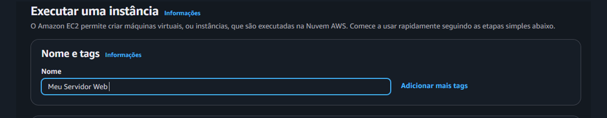

* **Escolha da AMI: Amazon Linux 2023**
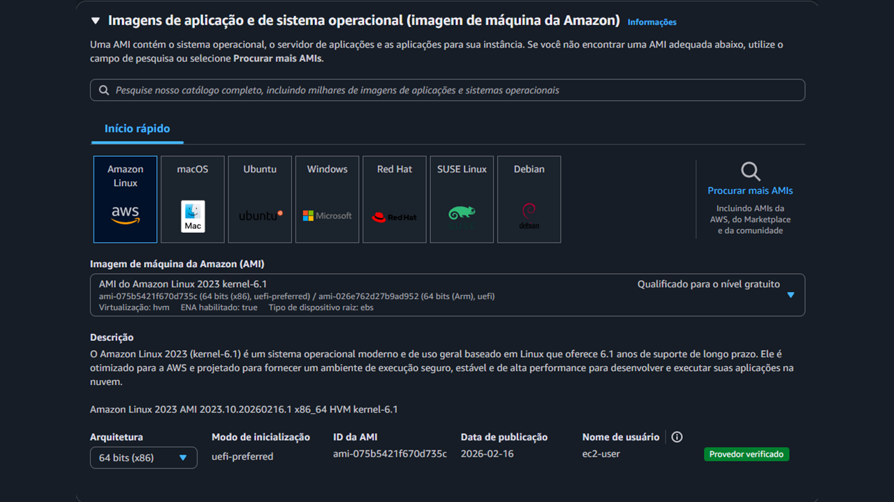

* **Escolha do Tipo de Instância: t3.micro**
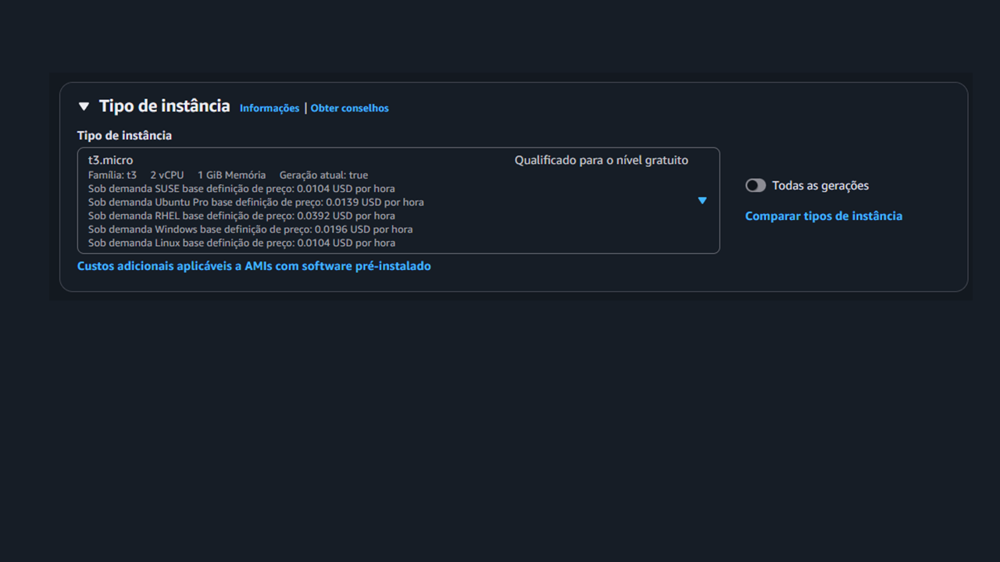

* **Ativação da proteção contra encerramento**
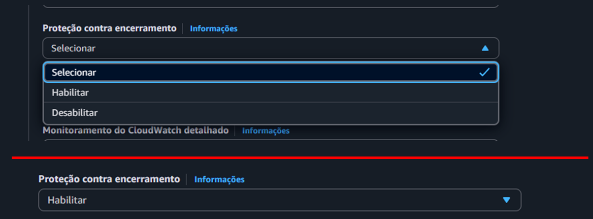

* **Resumo das configurações da instância**
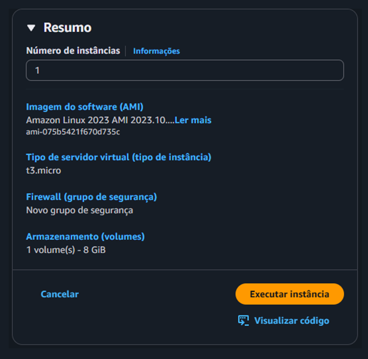

### 2. Automação com User Data
Utilizei o script abaixo para que a instância já subisse como um servidor web funcional:
```bash

#!/bin/bash
yum update -y
yum install -y httpd
systemctl enable httpd
systemctl start httpd
cat <<EOF > /var/www/html/index.html
<!DOCTYPE html>
<html lang="pt-br">
<head>
    <meta charset="UTF-8">
    <title>Servidor Ativo</title>
    <style>
        body { font-family: 'Segoe UI', Tahoma, Geneva, Verdana, sans-serif; background: #f0f2f5; display: flex; justify-content: center; align-items: center; height: 100vh; margin: 0; }
        .card { background: white; padding: 3rem; border-radius: 15px; box-shadow: 0 10px 25px rgba(0,0,0,0.1); text-align: center; max-width: 400px; }
        h1 { color: #1e272e; margin-bottom: 10px; }
        p { color: #485460; line-height: 1.6; }
        .status-container { margin-top: 20px; padding: 10px; background: #e8f8f5; border-radius: 8px; }
        .status { color: #05c46b; font-weight: bold; text-transform: uppercase; letter-spacing: 1px; }
    </style>
</head>
<body>
    <div class="card">
        <h1>🚀 Instância Online</h1>
        <p>O servidor web foi provisionado com sucesso via <b>User Data</b> e está pronto para uso.</p>
        <div class="status-container">
            <span class="status">● Status: Operacional</span>
        </div>
    </div>
</body>
</html>
EOF
chmod 644 /var/www/html/index.html

```

### 3. Ajuste de Segurança (Firewall)
Inicialmente, o servidor não estava acessível. Foi necessário editar as **Inbound Rules** do Security Group para permitir tráfego na porta **80 (HTTP)** vindo de qualquer lugar (0.0.0.0/0).

* **Painel de regras antes da alteração:**
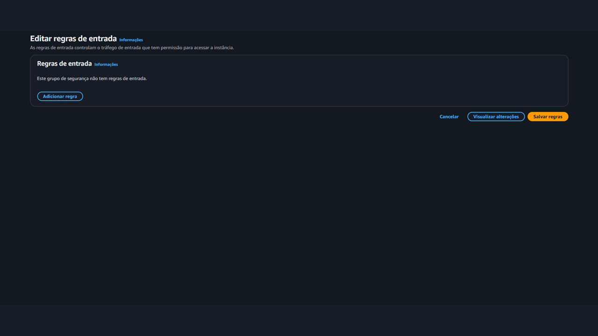

* **Servidor Web com erro:**
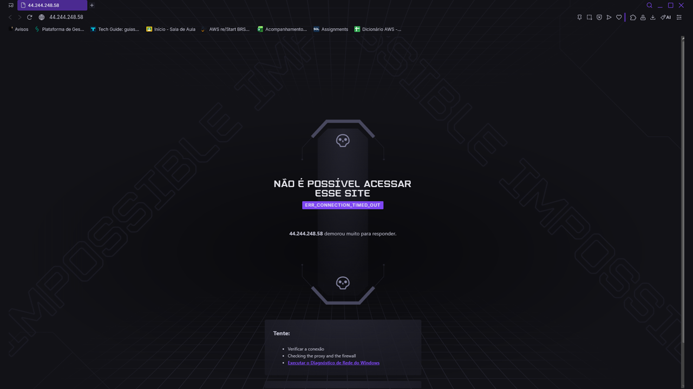

---

* **Adicionando regra para permitir o tráfego na porta  80 (HTTP):**
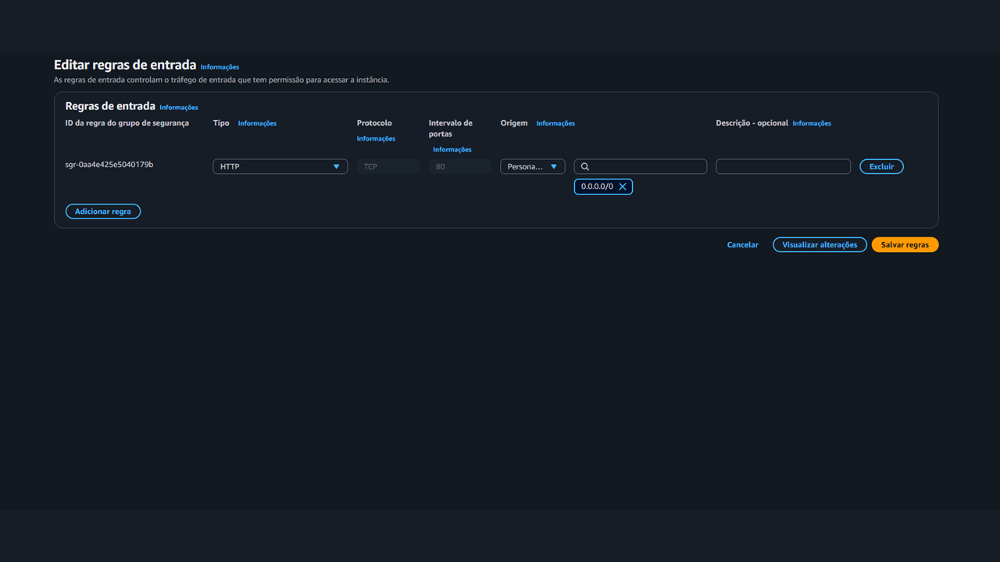

* **Servidor Web com acesso:**
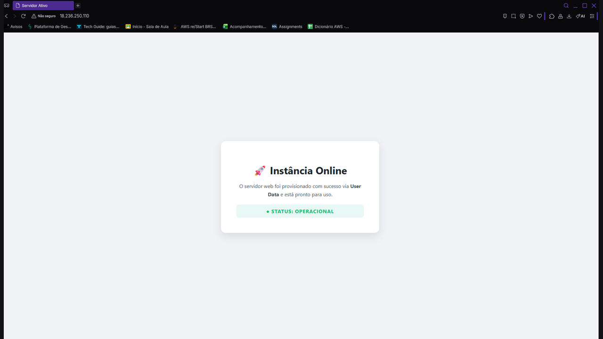


### 4. Redimensionamento e Armazenamento
Para simular uma necessidade de maior performance:
1. A instância foi interrompida.
2. O tipo de instância foi alterado de **t3.micro** para **t3.small**.
3. O volume EBS foi expandido de **8 GiB** para **10 GiB**.

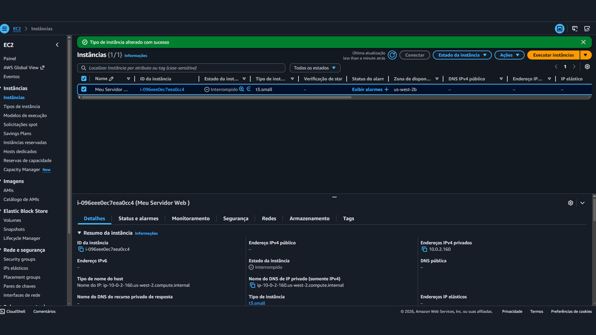

---

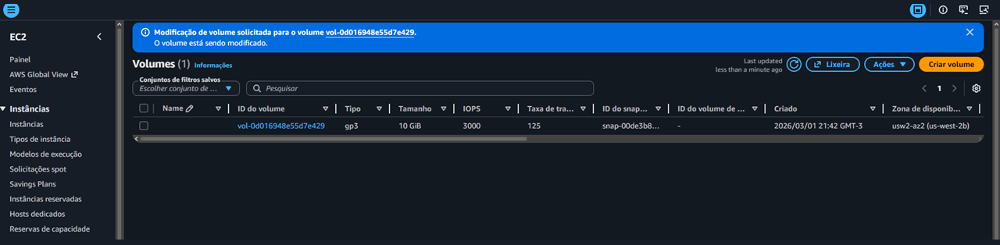

### 5. Proteção contra Encerramento (Termination Protection)

Uma configuração vital aplicada neste laboratório foi a **Proteção contra Encerramento**. Esta funcionalidade adiciona uma camada extra de segurança, impedindo que a instância seja terminada (excluída) acidentalmente através do console, CLI ou API.

### Como funciona:
* **Mecanismo de Defesa:** Se um utilizador tentar encerrar a instância com a proteção ativa, a AWS bloqueia a ação e exibe uma mensagem de erro.

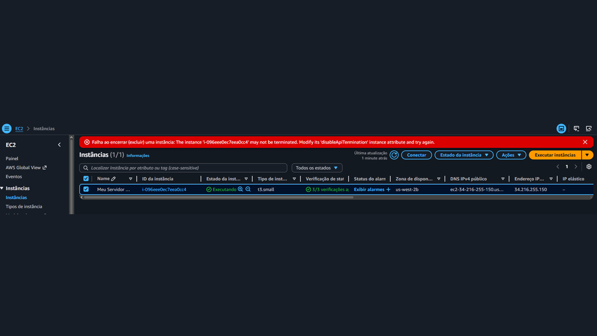

* **Procedimento de Exclusão:** Para remover a instância, é necessário primeiro desativar manualmente a proteção nas configurações da instância e só depois proceder ao encerramento.

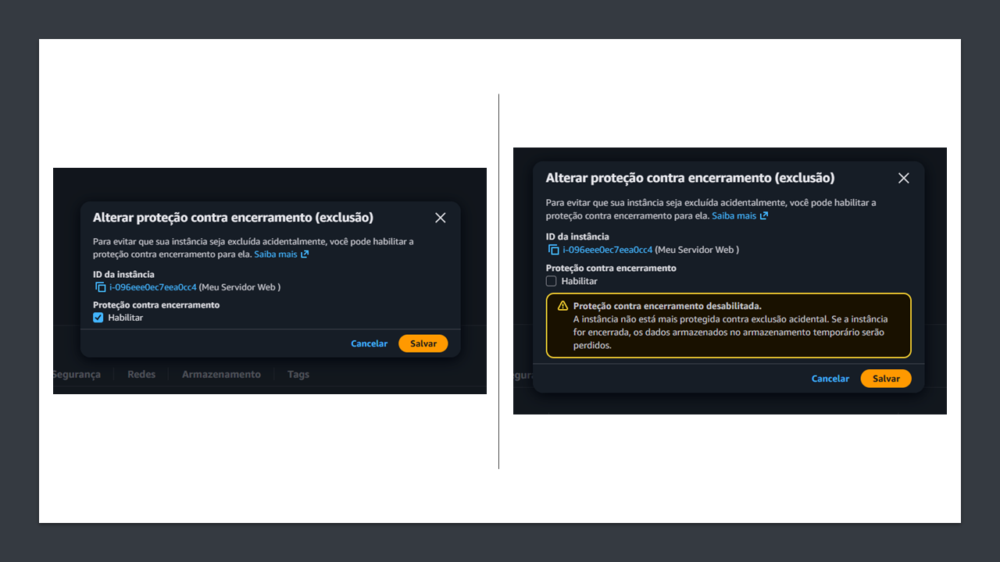

---

## 🧹 Limpeza de Recursos
Ao final, a proteção contra encerramento foi desativada para permitir a exclusão da instância e evitar custos desnecessários.
